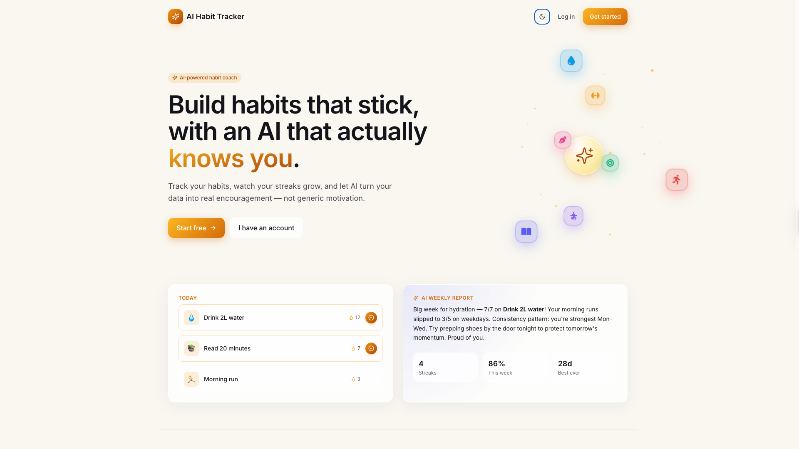
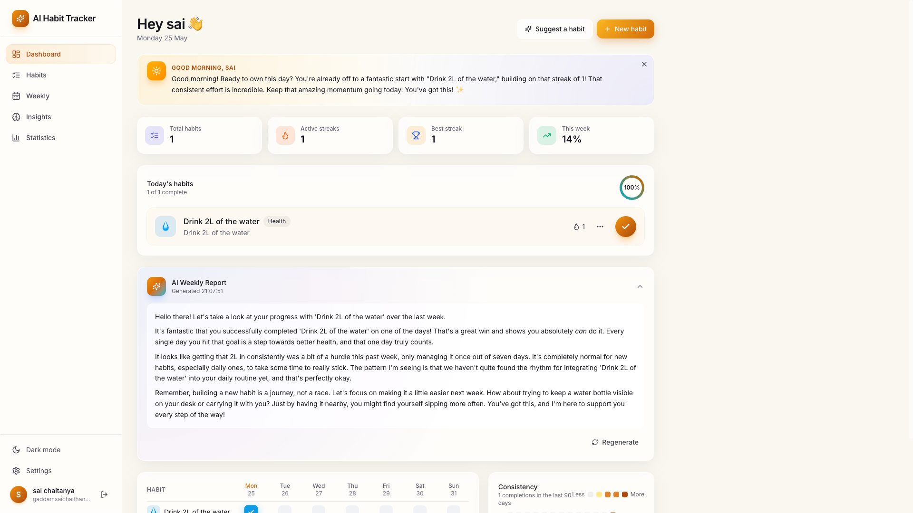
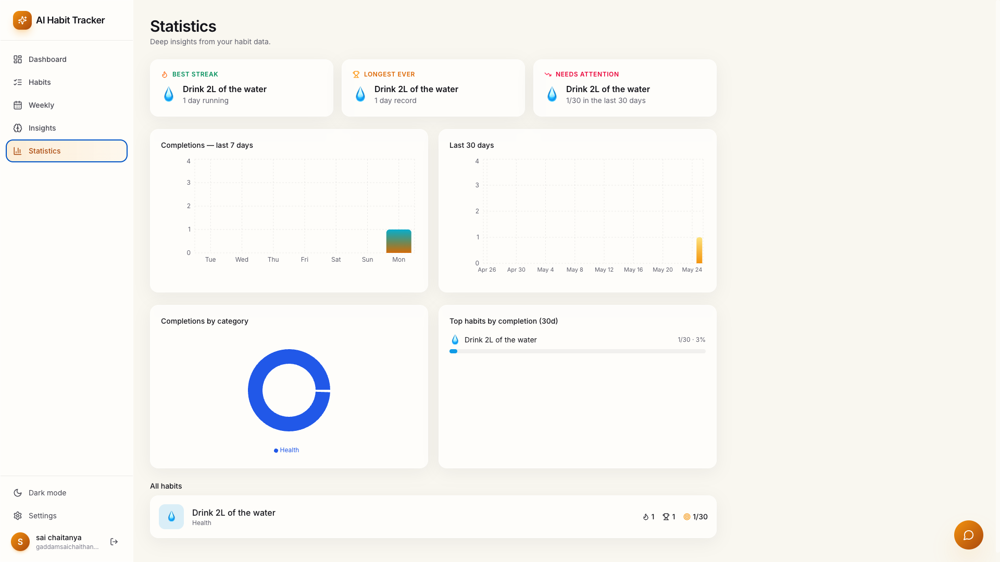
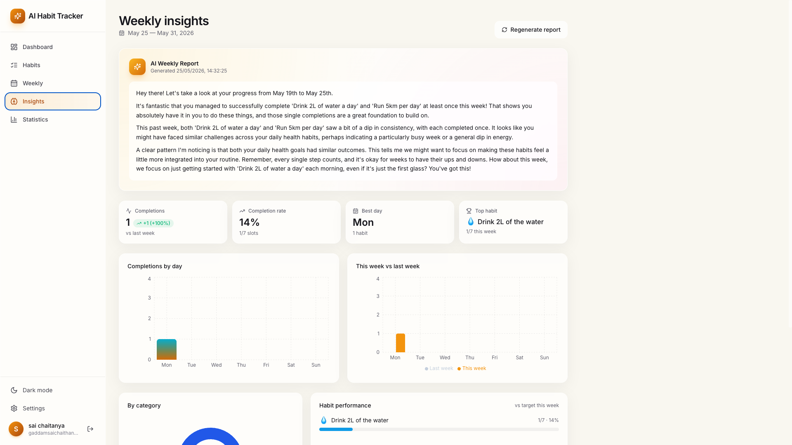
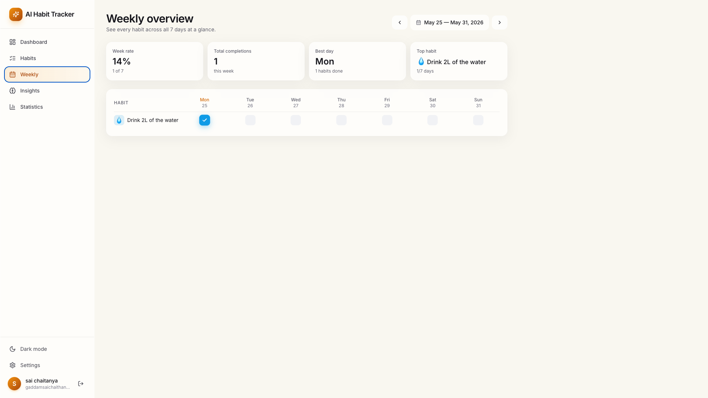
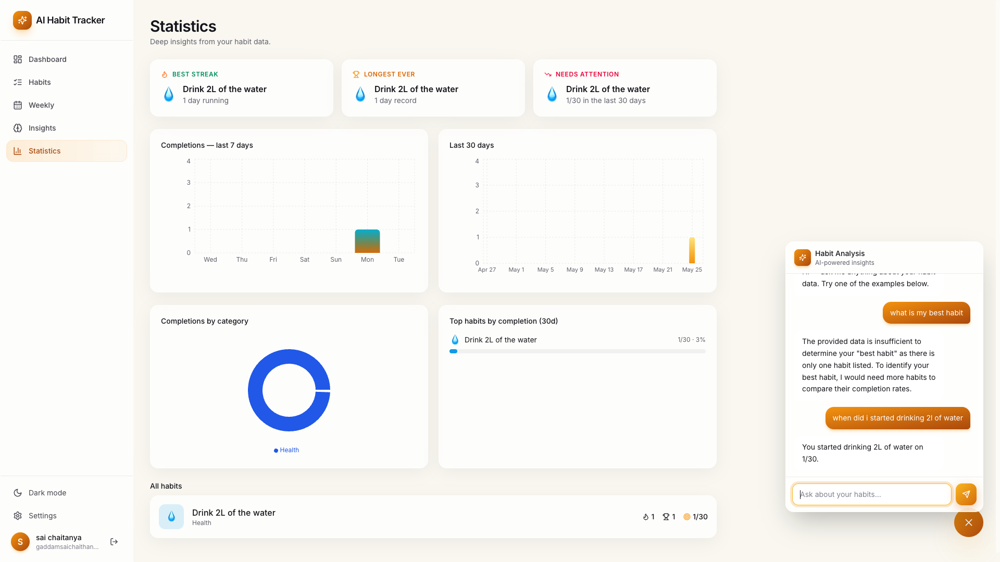
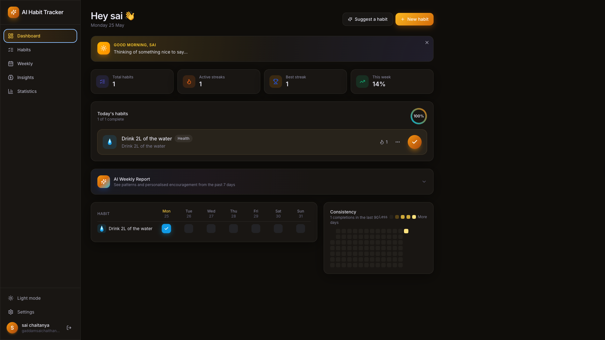

# 🚀 Smart Habit Tracker – AI Powered MERN Stack Application

<div align="center">


</div>

---

<div align="center">


</div>

---

<div align="center">


</div>

---

# 🌍 Live Demo

## Frontend

http://smart-habbit-tracker-frontend.s3-website-ap-southeast-2.amazonaws.com

---

# 🚀 Project Overview

Smart Habit Tracker is a production-style AI-powered MERN stack application designed to help users build consistency, track habits, analyze performance, and stay motivated using intelligent AI-driven features.

This project combines:

- Full Stack MERN Development
- AI-powered productivity tools
- Cloud deployment architecture
- Docker containerization
- AWS infrastructure
- CI/CD automation
- Production-style backend deployment

---

# 📸 Application Screenshots

## 🔐 Login Page



---

## 📊 Dashboard



---

## 📈 Statistics



---

## 🧠 AI Insights



---

## 📅 Weekly Overview



---

## 🤖 AI Insights Chat



---

## 🌙 Dark Mode UI



---

# 🌐 Production Architecture

```text
Frontend (React + Vite)
        ↓
AWS S3 Static Website Hosting
        ↓
Nginx Reverse Proxy
        ↓
Dockerized Node.js + Express Backend
        ↓
MongoDB Atlas
```

---

# ✨ Core Features

## 🔐 Authentication & Security

1. 🔐 User Authentication – Secure login & signup with JWT and bcrypt password hashing

---

## 📋 Habit Management

2. 📋 Habit Management – Create, edit, archive, and delete habits with categories, frequency, target days, icons, and colors

3. ✅ Daily Habit Tracking – One-click check-offs with confetti animations and progress rings

4. 🔥 Streak Tracking – Current streaks, longest streaks, and active streak counters

5. 📅 90-Day Heatmap – GitHub-style consistency visualization with theme-aware gradients

---

## 🤖 AI-Powered Features

6. 🤖 AI Weekly Report – Personalized review of the past 7 days powered by Google Gemini

7. 🧠 AI Habit Suggestions – Smart recommendations based on user goals, productive time, and previous struggles

8. 🚑 AI Streak Recovery Coach – Detects broken streaks of 7+ days and generates a personalized comeback plan

9. 💬 AI Habit Analysis Chat – Natural language Q&A about habit data with real statistics and patterns

10. 🌅 AI Morning Motivation – Personalized wake-up messages using actual habit names and streak data

---

## 📊 Analytics & Insights

11. 📊 Weekly Grid View – Interactive 7-day habit grid with week navigation and statistics

12. 📈 Insights Dashboard – AI reports, week-over-week comparisons, category charts, and habit performance metrics

13. 📉 Statistics Page – Monthly charts, streak records, top performers, and AI-powered analytics

---

## 🎨 User Experience

14. 🌙 Light & Dark Mode – Glassmorphism UI with aurora backgrounds and theme persistence

15. 📱 Responsive Design – Mobile-first layouts with adaptive navigation and bottom tab bar

---

# 🛠️ Tech Stack

## 🎨 Frontend

```text
React.js
Vite
Tailwind CSS
Axios
Context API
React Router DOM
```

---

## ⚙️ Backend

```text
Node.js
Express.js
MongoDB
Mongoose
JWT Authentication
Google Gemini API
```

---

## ☁️ Cloud & DevOps

```text
AWS EC2
AWS S3
Docker
Nginx
GitHub Actions CI/CD
MongoDB Atlas
Linux Ubuntu Server
PM2
```

---

# ☁️ Cloud Deployment & DevOps

## 🐳 Dockerized Backend

The backend was fully containerized using Docker for:

- Consistent deployments
- Environment portability
- Infrastructure management
- Production deployment workflows

---

## 🌐 AWS EC2 Deployment

Backend deployed on Ubuntu EC2 server with:

- Linux server management
- Security group configuration
- SSH infrastructure management
- Production API deployment

---

## 🔀 Nginx Reverse Proxy

Configured Nginx as a reverse proxy:

```text
Internet
↓
Nginx
↓
Docker Container
↓
Node.js Backend
```

Benefits:

- Production-grade routing
- Better scalability
- Reverse proxy architecture
- Clean infrastructure separation

---

## ⚡ PM2 Process Management

Configured PM2 for:

- Background server execution
- Automatic restart on crashes
- Persistent backend uptime
- Production process management

---

## 🔄 GitHub Actions CI/CD

Automated deployment pipeline:

```text
git push
↓
GitHub Actions
↓
SSH into EC2
↓
Pull latest code
↓
Rebuild Docker container
↓
Restart backend automatically
```

---

# 📂 Local Development Setup

## Clone Repository

```bash
git clone https://github.com/sai02-creator/Smart-habit-tracker-Frontend-MERNSTACK.git
```

---

## Install Dependencies

```bash
npm install
```

---

## Configure Environment Variables

Create `.env`

```env
VITE_API_BASE_URL=your_backend_url
```

---

## Run Frontend

```bash
npm run dev
```

---

# 🔥 DevOps & Engineering Concepts Used

- Docker containerization
- AWS cloud deployment
- Nginx reverse proxy configuration
- Linux server administration
- GitHub Actions CI/CD
- MongoDB Atlas integration
- SSH authentication
- Security group networking
- Production deployment workflows
- AI-powered application integration
- REST API architecture
- Cloud frontend hosting

---

# 🚀 Production Deployment Highlights

Successfully implemented:

- AI-powered MERN application
- Dockerized backend deployment
- AWS EC2 cloud infrastructure
- AWS S3 frontend hosting
- MongoDB Atlas cloud database
- Nginx reverse proxy
- PM2 production process management
- GitHub Actions automation
- Linux production server setup
- Responsive production UI

---

# 📈 Future Improvements

- HTTPS SSL Setup
- Custom Domain Configuration
- Kubernetes Deployment
- Docker Compose Multi-Service Architecture
- Monitoring & Logging
- Auto Scaling Infrastructure
- Advanced AI Analytics

---

# 👨‍💻 Author

## Sai Chaitanya Gaddam

### Full Stack Engineer | AI-Integrated Applications | Cloud & DevOps

<div align="center">

[](https://www.linkedin.com/in/sai-chaitanya-73b598284/)

[](https://github.com/sai02-creator)

</div>

---

<div align="center">


# ⭐ If you like this project, give it a star on GitHub ⭐

</div>
